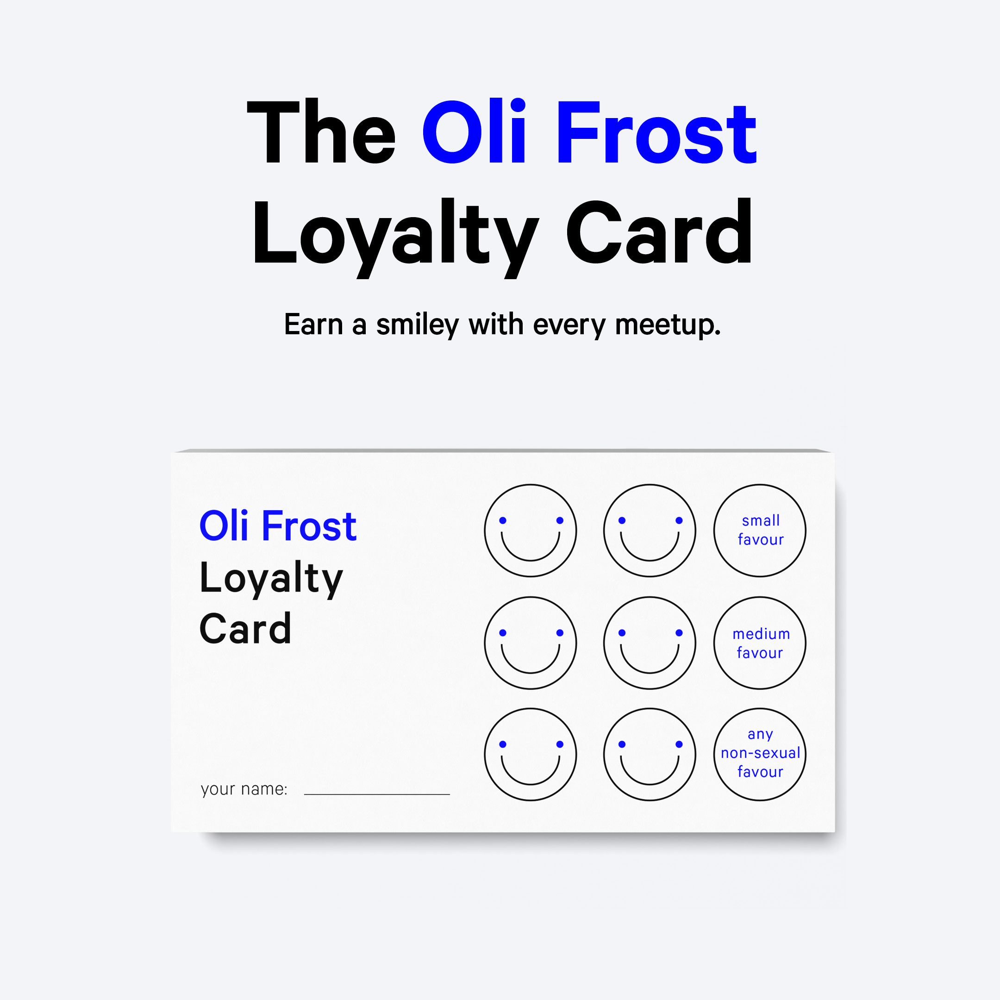
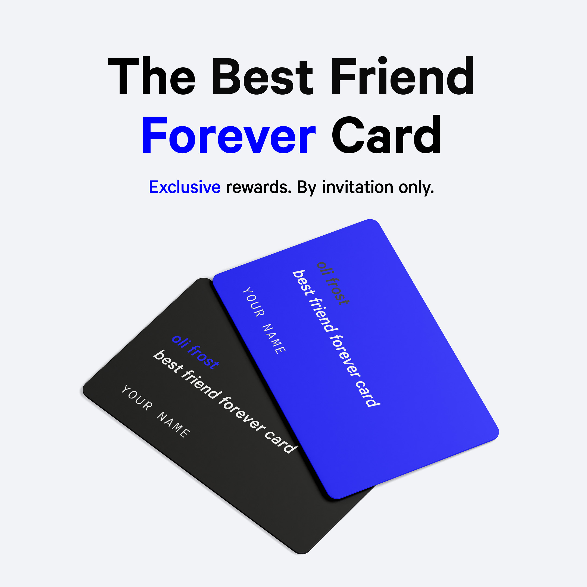

<link rel="stylesheet" href="https://use.fontawesome.com/releases/v5.8.1/css/all.css" integrity="sha384-50oBUHEmvpQ+1lW4y57PTFmhCaXp0ML5d60M1M7uH2+nqUivzIebhndOJK28anvf" crossorigin="anonymous">

  

    

      <h1 class="headline">Get £15 When You Refer Me A Friend</h1>
      
If we become friends, you both get £15<a href="#faq">*</a>.

      

          

        <a href="{{ page.twitterlink }}" class="button">Tag A Friend</a>
        <a href="{{ page.instagramlink }}" class="button">Tag A Friend</a>
        <a href="mailto:?cc=mail@olifro.st&subject=This guy seems cool!&body=If%20you%20become%20friends%20we'll%20both%20get%20%C2%A315%20https%3A//olifro.st/refer" class="button"> Invite Friend</a>
        

      

    

  

    

      

          

      

    

  
  

<h3 id="counter"><i class="fas fa-user-tag"></i> <a href="{{ page.instagramlink }}">232</a> Friends Tagged  (Since 15/10/19)</h3>

---

    

### <i class="fas fa-beer"></i>  Sensible Drinker
Oli Frost doesn't cry or get angry when drunk, and actually improves up to two pints.

  

  

### <i class="far fa-smile"></i>  Non-Threatening
Oli Frost is unlikely to steal your friends or girlfriends or wife or mum.

  

  

### <i class="fas fa-running"></i>  No Awkward Goodbyes

Oli Frost removes himself from social situations without a word – it's called a French exit

  

---

<h2>Offers for existing friends</h2>

    

Remember when loyalty meant more than a free coffee? When we meet up for the first time you'll get a loyalty card and a smiley stamp, which you can collect to earn various non-sexual favours. 
<em>Say Hi:</em> 

As exclusive as a Nandos Black Card, nobody knows how you get an Oli Frost Best Friend Forever Card. It gets you unlimited friendship for life and other exclusive benefits.  

<em>Invitation Only</em>

---

## <i class="fas fa-users"></i> Reviews from satisfied friends

    

>> "Oli is so good to have as a friend because he never makes a decision about where to go, so you always get your own way. He also never asks to see you so there’s literally no pressure."
>> <cite>– Adela Nash, from work</cite>

  

    

>> "Oli is a great friend. He sneaks up on you when you least expect it, and always leaves you wanting more. He has a great fashion sense too, ask to see his collection of plain t-shirts."
>> <cite>– Jamie Chang, from work</cite>

  

    

>> "Oli is always online; although he has disabled read receipts, he always replies promptly. This means that if you have any issues, he will (remotely) be there at all times."
>> <cite>– Augustine Cerf, from work</cite>

  

---

<h2 id="faq"></h2>

  

**Who are you?**  
I'm Oli Frost, the guy who [put all his personal data on eBay]({{ site.baseurl }}), played [recorder for Simon Cowell]({{ site.baseurl }}), and started the [Instagram faking service Lifefaker.com](http://lifefaker.com).

  

  

  **How do you define "friend"?**  
  A friend is anyone who meets the [Friendship Terms and Conditions](#terms-and-conditions), outlined at the bottom of this page

  

**How do I make a referral?**  
Any way you like, as long as there is a link back to this page. You can tag a friend on [Instagram]( {{ page.instagramlink }} ) and [Twitter]({{ page.twitterlink }}), or send an [email](mailto:{{ site.author.email }}).

**What if I see us as more than friends?**  
This isn't a Frequently Asked Question, but unfortunately I've already [found a girlfriend on Getty Images.]({{ site.baseurl }})

**Why are you running this offer?**  
I was very impressed by how Uber and Dropbox made friends like this. I also wanted friends.

**Where can I get my loyalty card?**  
You can request these in person, or if you're in San Francisco, at [The Glass Room](https://theglassroom.org/san-francisco) exhibit from October 10th to November 3rd.

---

  

      <h2><i class="far fa-life-ring"></i> Need support?</h2>
      
Am I being a bad friend? Chat to me, our live support team, on <a href="https://instagram.com/{{ site.author.instagram }}">Instagram</a> or <a href="https://twitter.com/{{ site.author.twitter }}">Twitter</a> – and I'll get back to you in 4-7 working days.

  

  

      <h2><i class="fas fa-envelope-open"></i> Hear about new offers</h2>
      
  

---

## Terms and Conditions

After your application to become a friend is received you will enter a pre-friend stage (acquaintance) until both parties are satisfied that the following conditions are reached (or would be reached, should the correct circumstances pertain). By applying you agree to being contacted with a friendly “Hi” to start proceedings but agree it would be better form if you said hi first. Our conversations should continue for longer enough for you to make one accidental video dial. You must reply to messages within three days unless you have been extremely busy or otherwise flat out. If it feels the conversation has come to an end you agree it would be polite to ‘Like’ the last message. You should occasionally send high-five or clapping hands to my Instagram Story. You agree not to comment on my posts with fire emoji and stick to colder emojis such as the frost snowflake. You must offer pity likes to unpopular Instagram posts. And pity laughs to unpopular anecdotes at social events. You must be ready to invite me to your birthday if you are having more than a medium to small sized thing. You must not be disappointed if I’m the first person to arrive at your medium to small sized thing. You must be comfortable with me borrowing a jumper for up to a week. You must be comfortable with unpaid debts of up to £5. You must be prepared to hold my beer for longer than one minute. If you have a spare ticket to something I'd enjoy, you must at least consider inviting me before choosing someone else. You must share at least ten impersonal facts about yourself, three fairly vulnerable ones, and one crushing truth that causes you sleep deprivation. Only one of these facts can be an inventive lie. You must be willing to look through one full photo album from my childhood (at best, this will be delivered as an interactive powerpoint presentation). On Mondays you should not feel obliged to ask how my weekend was because we’re past that now. You must offer a list of six potential in-jokes that we can revel in conspiratorially as best friends. We must have one song that we both like that is not in the Top 40. You can correctly identify mannerisms that are like mine and use the expression “That’s so Oli”. You must be able to name one of my three cats. You must agree that my cat is a genius. In the pre-friend stage you may be tested on any of the above points at any time – should you fail to react or answer correctly you may have to wait a minimum of 14 days before friendship is re-evaluated. As an experienced friend, I’m very open to feedback. If you have any comments on the process, please put your thoughts in an email and send them to me. You are allowed to choose a preferred method to receive funds after completion, but not Venmo as I don’t have that yet.

---
